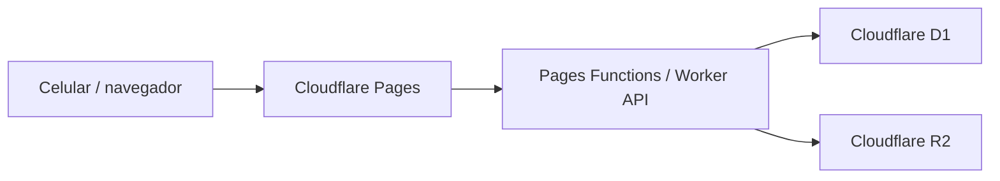

# Spec: Integracion Cloudflare para Hive Avances

## Objetivo

Publicar la app en internet y guardar avances compartidos en nube, separando:

- App web: Cloudflare Pages.
- API: Cloudflare Pages Functions o Worker.
- Datos: Cloudflare D1.
- Fotos: Cloudflare R2.

La app debe seguir funcionando bien en celular, comprimir fotos antes de subirlas y permitir que varias personas vean el mismo avance.

## Alcance

Incluido:

- CRUD de avances por habitacion y partida.
- Carga de fotos comprimidas desde celular.
- Almacenamiento de fotos en R2.
- Registro de metadatos en D1.
- Listado y reporte diario desde datos sincronizados.
- Modo offline/local como respaldo.

No incluido en primera fase:

- Login con usuarios individuales. La primera fase usa HTTP Basic Auth.
- Roles avanzados.
- Edicion colaborativa en tiempo real por WebSocket.
- Panel administrativo separado.

## Arquitectura



## Estructura propuesta

```text
/
  index.html
  styles.css
  app.js
  manifest.webmanifest
  sw.js
  functions/
    api/
      health.js
      rooms/
        [room].js
      records/
        index.js
        [id].js
      uploads/
        index.js
      photos/
        [key].js
  migrations/
    0001_initial.sql
  wrangler.toml
```

## Modelo de datos

### Tabla `records`

Cada fila representa el avance de una partida en una habitacion.

```sql
CREATE TABLE IF NOT EXISTS records (
  id TEXT PRIMARY KEY,
  room TEXT NOT NULL,
  category TEXT NOT NULL,
  item TEXT NOT NULL,
  owner TEXT,
  status TEXT NOT NULL CHECK (status IN ('pendiente', 'defectuoso', 'completado')),
  note TEXT,
  inspector TEXT,
  report_date TEXT NOT NULL,
  updated_at TEXT NOT NULL,
  created_at TEXT NOT NULL
);

CREATE INDEX IF NOT EXISTS idx_records_room ON records(room);
CREATE INDEX IF NOT EXISTS idx_records_date ON records(report_date);
CREATE INDEX IF NOT EXISTS idx_records_status ON records(status);
```

### Tabla `photos`

Cada fila representa una foto almacenada en R2.

```sql
CREATE TABLE IF NOT EXISTS photos (
  id TEXT PRIMARY KEY,
  record_id TEXT NOT NULL,
  r2_key TEXT NOT NULL,
  file_name TEXT,
  content_type TEXT NOT NULL,
  size_bytes INTEGER NOT NULL,
  width INTEGER,
  height INTEGER,
  created_at TEXT NOT NULL,
  FOREIGN KEY (record_id) REFERENCES records(id) ON DELETE CASCADE
);

CREATE INDEX IF NOT EXISTS idx_photos_record ON photos(record_id);
```

## Identificadores

`record.id` debe ser deterministico:

```text
habitacion::categoria::partida
```

Ejemplo:

```text
101::Puerta habitacion::Marco
```

En URLs se envia codificado con `encodeURIComponent`.

## API

Todas las respuestas son JSON salvo descarga de foto.

### `GET /api/health`

Verifica que la API esta viva.

Respuesta:

```json
{ "ok": true }
```

### `GET /api/rooms/:room`

Devuelve todos los registros y fotos de una habitacion.

Respuesta:

```json
{
  "room": "101",
  "records": [
    {
      "id": "101::Puerta habitacion::Marco",
      "room": "101",
      "category": "Puerta habitacion",
      "item": "Marco",
      "owner": "MIFE",
      "status": "pendiente",
      "note": "",
      "inspector": "Santiago",
      "reportDate": "2026-05-25",
      "updatedAt": "2026-05-25T20:00:00.000Z",
      "photos": [
        {
          "id": "photo_...",
          "url": "/api/photos/rooms/101/photo_....jpg",
          "sizeBytes": 245000
        }
      ]
    }
  ]
}
```

### `PUT /api/records/:id`

Crea o actualiza un registro.

Body:

```json
{
  "room": "101",
  "category": "Puerta habitacion",
  "item": "Marco",
  "owner": "MIFE",
  "status": "defectuoso",
  "note": "Revisar pintura",
  "inspector": "Santiago",
  "reportDate": "2026-05-25"
}
```

Validaciones:

- `status`: solo `pendiente`, `defectuoso`, `completado`.
- `room`, `category`, `item`, `reportDate`: requeridos.
- `note`: maximo 2000 caracteres.
- `inspector`: maximo 120 caracteres.

### `POST /api/uploads`

Sube una foto a R2 y la asocia a un registro.

Formato recomendado:

`multipart/form-data`

Campos:

- `recordId`
- `room`
- `file`

Validaciones:

- Solo `image/jpeg`, `image/png`, `image/webp`.
- Maximo inicial: 5 MB despues de compresion cliente.
- Maximo 3 fotos por registro en fase 1.

Respuesta:

```json
{
  "photo": {
    "id": "photo_...",
    "url": "/api/photos/rooms/101/photo_....jpg",
    "sizeBytes": 245000
  }
}
```

### `GET /api/photos/:key`

Lee la imagen desde R2.

Notas:

- No exponer el bucket R2 como publico en primera fase.
- Servir fotos desde Worker para controlar permisos y cache.
- Agregar `Cache-Control` para reducir costo y latencia.

## Cambios al frontend

### Estado local

Mantener `localStorage` como cache temporal:

- Si API responde: sincronizar desde nube.
- Si API falla: permitir capturar localmente y mostrar estado `Sin conexion`.
- Cuando vuelva conexion: subir cambios pendientes.

### Nuevo modulo recomendado

Crear `cloudflare-api.js`:

```js
export async function fetchRoom(room) {}
export async function saveRecord(record) {}
export async function uploadPhoto(recordId, room, file) {}
```

Mantener `app.js` enfocado en UI y estado.

### Fotos

Antes de subir:

- Redimensionar a maximo 1200 px en el lado mayor.
- Convertir a JPEG/WebP.
- Calidad inicial: 0.72.
- Limitar a 3 fotos por partida.

La base de datos guarda solo metadatos y `r2_key`; no guarda base64.

## Seguridad

Fase 1:

- Sitio y API protegidos con HTTP Basic Auth.
- Usuario y contrasena guardados como secretos en Cloudflare:
  - `BASIC_AUTH_USER`
  - `BASIC_AUTH_PASS`
- El navegador mostrara el prompt nativo de usuario/contrasena.

Fase 2:

- Usuarios reales con magic link, correo o PIN.
- Roles: admin, supervisor, capturista, lectura.
- Auditoria de cambios.

### Riesgos si no hay autenticacion

Si la app queda publica y la API acepta escrituras anonimas, cualquier persona con la liga podria modificar avances o subir fotos. No se recomienda.

## Configuracion Cloudflare

### `wrangler.toml`

```toml
name = "hive-avances"
compatibility_date = "2026-05-25"
pages_build_output_dir = "."

[[d1_databases]]
binding = "DB"
database_name = "hive_avances"
database_id = "REEMPLAZAR_CON_DATABASE_ID"

[[r2_buckets]]
binding = "PHOTOS"
bucket_name = "hive-avances-photos"
```

### Secretos

```powershell
wrangler secret put BASIC_AUTH_USER
wrangler secret put BASIC_AUTH_PASS
```

## Plan de implementacion

1. Crear proyecto Cloudflare Pages.
2. Crear D1 `hive_avances`.
3. Ejecutar migracion `0001_initial.sql`.
4. Crear bucket R2 `hive-avances-photos`.
5. Configurar bindings `DB` y `PHOTOS`.
6. Agregar API en `functions/api`.
7. Reemplazar Firebase/local sync por `cloudflare-api.js`.
8. Probar local con `wrangler pages dev`.
9. Publicar.
10. Probar desde dos celulares: cambios, fotos y reporte.

## Criterios de aceptacion

- La app abre desde una URL publica HTTPS.
- Dos celulares ven los mismos avances para una habitacion.
- Una foto tomada desde celular se comprime y se guarda en R2.
- El registro en D1 guarda estatus, observacion, responsable y referencia a la foto.
- El reporte diario incluye datos sincronizados desde la nube.
- Si no hay internet, la app permite capturar localmente y marca pendiente de sincronizar.

## Informacion pendiente

Decisiones confirmadas:

1. Acceso con HTTP Basic Auth.
2. Maximo 3 fotos por partida.
3. Las fotos se conservan indefinidamente como evidencia.
4. Reportes: todos los cortes disponibles, por dia, habitacion, piso y responsable.
5. Cuenta Cloudflare creada.
